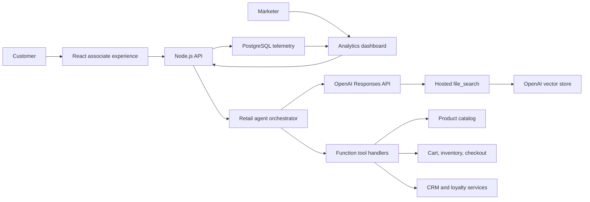

# Solution Architecture

## Objective

The Brand Experience Agent helps retail customers discover products, receive personalized recommendations, understand approved brand and policy content, and complete purchase-oriented tasks through natural conversation.

## System Design

## Runtime Flow

1. The React client sends a customer message, profile context, and recent conversation history to `/api/chat`.
2. The server builds retail-specific instructions with brand governance, escalation rules, and customer profile context.
3. The Responses API receives file search plus function tools.
4. If the model returns function calls, the server executes approved handlers and appends `function_call_output` items to the running input.
5. The final response is stored with intent, journey stage, citations, recommended product IDs, guardrail flags, and latency.
6. The dashboard reads aggregated marketing intelligence from `/api/admin/analytics`.

## Core Modules

- Agent orchestration: `src/server/agent/retailAgent.ts`
- Brand policy and stage inference: `src/server/agent/policy.ts`
- Function tool schemas: `src/server/tools/definitions.ts`
- Function execution: `src/server/tools/handlers.ts`
- Product catalog service: `src/server/services/catalog.ts`
- Telemetry repository: `src/server/db/repository.ts`
- React associate workspace: `src/client/components/ChatPanel.tsx`
- Analytics dashboard: `src/client/components/Dashboard.tsx`

## Knowledge Base

The ingestion script uploads approved files from `data/knowledge` to OpenAI Files and attaches them to a vector store. The agent includes a `file_search` tool only when `OPENAI_VECTOR_STORE_ID` is configured.

Initial content domains:

- Brand guidelines
- Customer FAQ
- Campaign messaging
- Returns and warranty policy

## Function Integrations

Implemented function tools:

- `searchProducts`
- `compareProducts`
- `checkInventory`
- `addToCart`
- `startCheckout`
- `createLead`
- `updateCustomerProfile`
- `getLoyaltyStatus`
- `getOrderStatus`
- `createReturnRequest`
- `trackIntent`
- `trackConversionEvent`

## Brand Governance

The policy layer enforces a consultative tone, prevents unsupported product claims, avoids invented discounts, and routes sensitive requests to humans. The function tool boundary keeps commerce, CRM, loyalty, order, and analytics actions auditable.

## Deployment Architecture

Recommended production topology:

- Static React build served from a CDN or edge hosting.
- Node.js API on a container platform.
- PostgreSQL with automated backups and point-in-time recovery.
- OpenAI API credentials stored in a managed secret store.
- Product, CRM, order, loyalty, and checkout functions replaced with production service adapters.
- Observability via structured API logs, request IDs, model latency metrics, tool-call metrics, and dashboard event streams.

## Evaluation Framework

`npm run evals` measures:

- Intent accuracy
- Recommendation relevance
- Citation presence
- Latency

Future production evals should add retrieval accuracy, hallucination checks, brand tone graders, conversion lift experiments, and human review queues for escalations.
